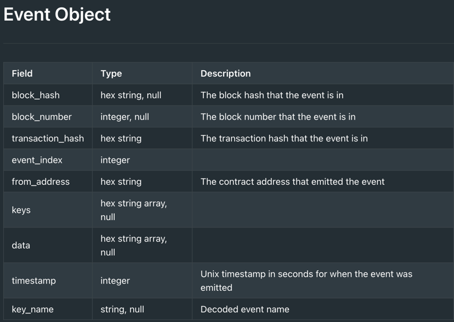

After fetch events, receive list of events like this:

````
{
      "block_hash": "0x00f8b24dc9a3860bbcade369282c765a7cc68fbd1d5b1fe3269bd80ea948a20a",
      "block_number": 465443,
      "transaction_hash": "0x060342ca69cf7f387253fcbe1645b0953629a60aa385c492017496cb8848ab10",
      "event_index": 4,
      "from_address": "0x04c0a5193d58f74fbace4b74dcf65481e734ed1714121bdc571da345540efa05",
      "keys": [
        "0x9149d2123147c5f43d258257fef0b7b969db78269369ebcf5ebb9eef8592f2"
      ],
      "data": [
        "0x6916e2962c7d9547bfe2c810c4ede0469ae3420e740bede350beb559d7bc0a1",
        "0x3fe2b97c1fd336e750087d68b9b867997fd64a2661ff3ca5a7c771641e8e7ac",
        "0x7e3f"
      ],
      "timestamp": 1702296974,
      "key_name": "zklend::market::Market::Deposit"
    }
````

The documentation doesn't say much about what is what:



The only thing that can be understood from here is the event type. (f.e. Deposit)

The website https://zklend.gitbook.io/documentation/about/portal also lacks the necessary information.


What's not clear (If the response of [this api endpoint](https://starkscan.readme.io/reference/retrieve-events) is raw data):

1. How we define "current state of loans" (from part 2 in task) that should be constructed
2. How we define "Loan" for which a python class should be created (this is especially unclear because the need is the update_state function, what does it do? update the state of individual loan? That makes no sense to me)

In general, it is not clear to me what is expected to be done with such raw data.
Which state is being updated from "Loan class"?

The only thing that makes sense to me based on this is that we want to aggregate by asset in $.